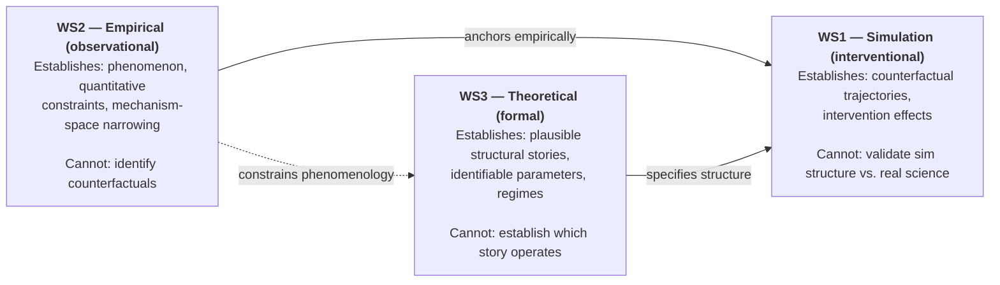
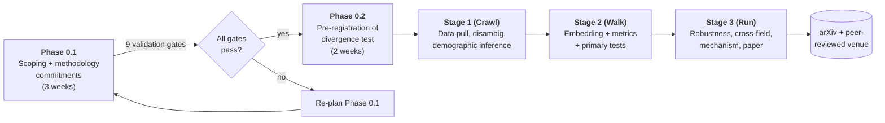
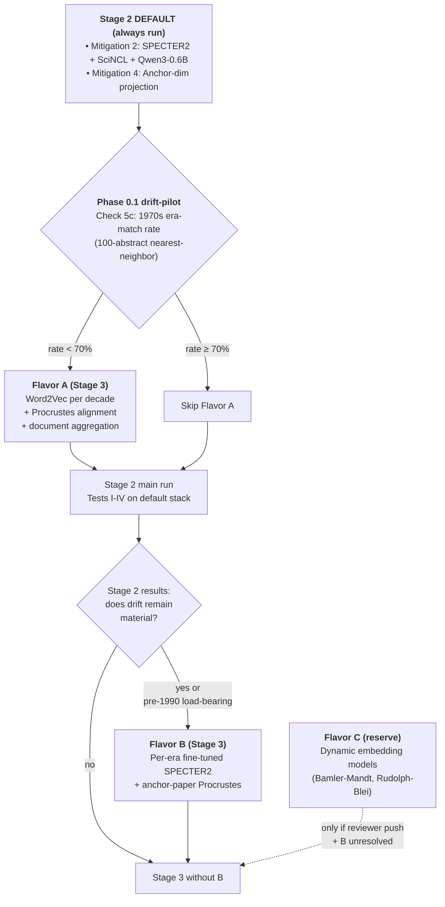
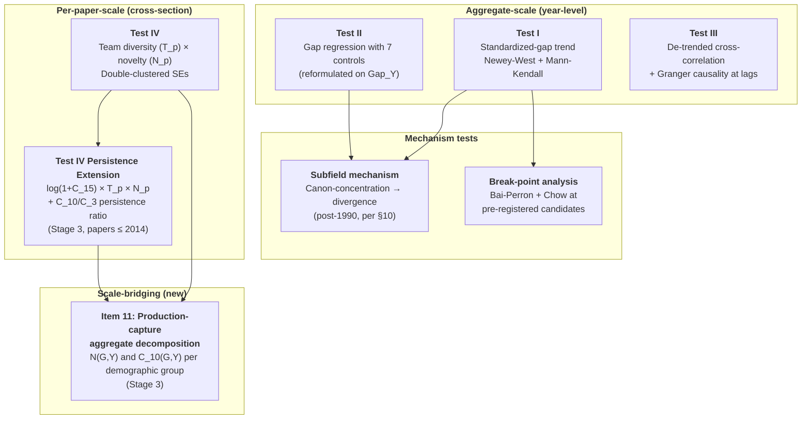
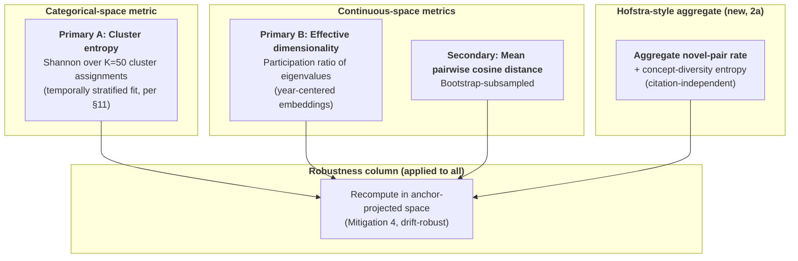
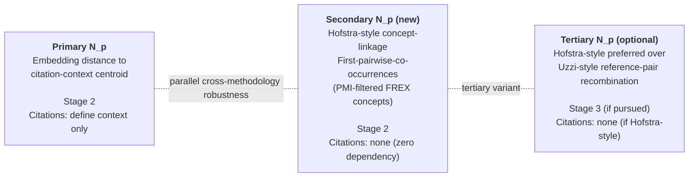
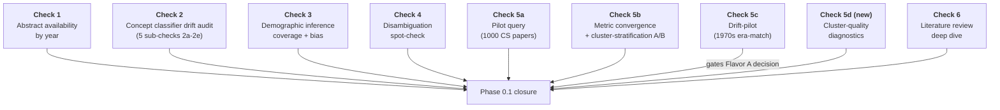

# Whitespace 2 — Plan at a Glance

**Purpose.** Visual summary of the Phase 0.1 scoping and Phase 0.2
pre-registration decisions. Complements — does not replace — the
authoritative plan in `phases/phase-0.1-plan.md`. Use this doc to:

- See the decision structure before diving into text
- Identify where a branch point lives before re-reading
- Explain the plan shape to a collaborator, reviewer, or future-you
- Check whether the plan's conditional logic still holds after updates

**Relationship to authoritative plan.** When `phases/phase-0.1-plan.md`
and this doc disagree, the plan wins. This doc is a derivative
representation; keep it in sync when the plan updates, but don't treat
it as the commitment.

**Diagrams use Mermaid** (renders on GitHub and in most Markdown
viewers). If a diagram seems stale after a plan update, regenerate.

---

## 1. Program context: three whitespaces, three epistemic layers

The originality research program has three whitespaces, each operating
on a distinct epistemic layer. Ws2 is one of three; its role in the
program determines what it must establish and what it can defer.

**Consequence for ws2's framing:** Methods and Discussion reserve
counterfactual claims for ws1. Ws2 documents the phenomenon and
narrows the space of plausible structural stories; it does not claim
to identify the true one. See `conceptual.md` §"Epistemic scope and
limits" for the full argument.

---

## 2. Phase and stage backbone

Phase 0 scoping produces the pre-registered plan; Stages 1–3 execute
it. Validation gates separate phases; gate failures trigger re-planning
rather than silent proceeding.

**Phase 0.1 gate summary** (full list in plan §"Validation gates"):
pilot query returns expected data; abstract coverage workable;
classifier drift characterized; demographic inference coverage
characterized; disambiguation error spot-checked; field definitions
committed; retro written; literature review closed; drift-pilot
decision committed.

---

## 3. Drift-mitigation ladder (conditional branching)

Drift mitigation operates on two axes. Cross-architecture robustness
(Mitigation 2, cross-model replication) is always run; sophistication
axis (Flavor B, per-era fine-tune) is conditional on Stage 2 results.
Flavor A is conditional on the Phase 0.1 drift-pilot result.

**Rationale for two axes** (full explanation in plan subsection 2):
Flavor A adds *cross-architecture* robustness (Word2Vec is non-
transformer); Flavor B adds *sophistication* on the domain-adaptation
dimension. They address different aspects of drift; they're not
sequential escalations of one ladder.

---

## 4. Test structure

Four co-primary tests, one mechanism test, one break-point analysis,
with several Stage 3 extensions. Tests I–III operate at aggregate
scale; Test IV operates at per-paper scale; item 11 (the new
production-capture decomposition) bridges the two scales.

**Scale logic:** Tests I–III document aggregate distributional
patterns; Test IV documents per-paper relationships; item 11 uses
per-paper measurements aggregated by demographic group to produce
a population-scale externality claim. See Hofstra review Synthesis
Pointer 11 for the scale-difference framing.

---

## 5. Semantic-diversity metric stack

Three metrics across two families, with a shared robustness column.

**K=50 main choice** justified empirically in Phase 0.1 Check 5d
(cluster-quality diagnostics). **Cluster fit** on temporally-
stratified pooled subsample (equal papers per decade). Non-negotiable
per desiderata §11.

---

## 6. Novelty metric stack (Test IV)

Three per-paper novelty constructions, running at different Stages,
with different citation dependencies.

**Why secondary exists:** Hofstra's "plethora of reasons to cite"
concern motivates a citation-independent parallel measure. Co-movement
of primary and secondary under Test IV's team-diversity regression
is cross-methodology robustness.

**Why tertiary is optional:** Stage 3 extension; only pursued if
resources allow or reviewers push.

---

## 7. Pathway coverage (Claim #13)

Ws2's engagement level with the 8 pathways for Claim #13. Silent
pathways are substantive scope choices, not omissions.

| Pathway | Engagement | Primary mechanism in ws2 |
|---|---|---|
| 13-A Channel/recommender convergence | Circumstantial | Break-point timing near platform eras |
| **13-B Demographic diversification as cosmetic** | **Direct test** | Tests I–III + Test IV + Item 11 |
| 13-C Institutional selection pressure | Indirect | Prestige/career controls in Test II |
| **13-D Network-topology convergence** | **Direct test** | Subfield mechanism test (Chu-Evans) |
| 13-E Translation/linguistic asymmetry | Silent | English-only corpus |
| **13-F Measurement artifact (null)** | **Directly constrained** | Drift-mitigation ladder + metric plurality |
| 13-G Individual conformity psychology | Silent | No individual-level measures |
| 13-H Endogenous actuator emergence | Weakly suggestive | Break-point patterns |

**Direct coverage:** 3 of 8 pathways (13-B, 13-D, 13-F).
**Circumstantial/indirect/weakly suggestive:** 3 of 8 (13-A, 13-C, 13-H).
**Silent:** 2 of 8 (13-E, 13-G).

**Where the discounted pathways live:** 13-A and 13-G require
interventional or individual-level methodology; scope-appropriate for
ws1 follow-up, not ws2.

---

## 8. Phase 0.1 sanity-check structure

Five numbered checks, two with sub-checks, one with a new addition.
Output lives in `experiments/phase-0.1/`.

**C5c is load-bearing:** its era-match rate result decides whether
Flavor A is committed as a Stage 3 escalation (see diagram 3 above).

---

## Maintenance notes

**When to update this doc:**

- Plan subsection changes that alter a diagram's structure → update
  the corresponding diagram.
- New tests or analyses committed to Phase 0.2 → update diagram 4
  (test structure) and diagram 7 (pathway coverage if applicable).
- Drift-mitigation conditions change → update diagram 3.
- New phases added (e.g., Phase 0.3) → update diagram 2.

**When this doc is authoritative:** never. The plan is authoritative;
this is derivative.

**When to revisit the doc's level of detail:** if a reader needs to
consult the plan to understand a diagram, either the diagram is too
abstract (add detail) or the plan is overspecified for a visual
summary (simplify the plan text). Both cases suggest an edit to one
or the other.
