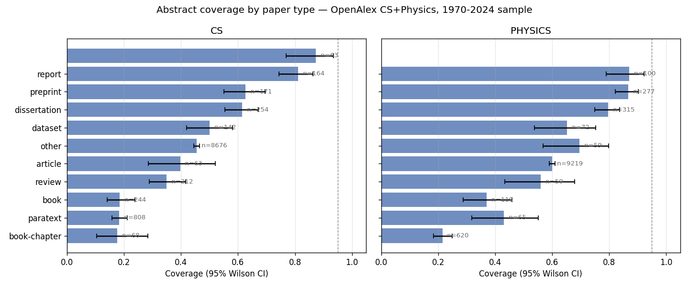

# Check 1c — Abstract coverage by paper type

**Run date:** 2026-04-27
**Snapshot recorded:** 2026-04-27T20:35:56+00:00
**Sample design:** same as Check 1 (200 papers per year × field cell, seed=42), with `type` added to OpenAlex select projection.
**Total papers:** 22000

## Question

Check 1 found overall abstract coverage at ~50-70% rather than the planned ~95%.
Is the bottleneck uniform across paper types, or concentrated in specific types
(proceedings, book-chapters, etc.) that ws2 could scope out to recover near-full
coverage on the remainder?

## Coverage by type

Cells with fewer than 50 papers across the 1970-2024 sample are dropped (sample-size
stability). Coverage = mean(has_abstract) within each (type, field) cell.

| Type | CS coverage | CS n | Physics coverage | Physics n |
|------|------------:|-----:|-----------------:|----------:|
| article | 45.5% | 8676 | 60.0% | 9219 |
| book | 34.9% | 212 | 37.0% | 119 |
| book-chapter | 18.3% | 808 | 21.5% | 620 |
| dataset | 61.4% | 254 | 65.3% | 72 |
| dissertation | 62.6% | 171 | 79.7% | 315 |
| libguides | 17.6% | 68 | — | 0 |
| other | 50.0% | 142 | 69.5% | 59 |
| paratext | 18.4% | 244 | 43.1% | 65 |
| preprint | 81.1% | 164 | 86.6% | 277 |
| report | 87.3% | 63 | 87.0% | 100 |
| review | 39.7% | 63 | 55.9% | 59 |

## High-coverage types (≥85%)

- **report / cs**: 87.3% (n=63)
- **report / physics**: 87.0% (n=100)
- **preprint / physics**: 86.6% (n=277)

## Low-coverage types (<50%)

- **article / cs**: 45.5% (n=8676)
- **review / cs**: 39.7% (n=63)
- **book / cs**: 34.9% (n=212)
- **paratext / cs**: 18.4% (n=244)
- **book-chapter / cs**: 18.3% (n=808)
- **libguides / cs**: 17.6% (n=68)
- **paratext / physics**: 43.1% (n=65)
- **book / physics**: 37.0% (n=119)
- **book-chapter / physics**: 21.5% (n=620)

## Plot

## Interpretation

**The bottleneck is NOT meaningfully concentrated in specific types — restricting by
type does not recover coverage.** Three observations support this:

1. **`article` is dominant and middle-of-the-pack.** Articles are ~80% of both fields' samples
   (CS: 8,676 / 11,000 ≈ 79%; Physics: 9,219 / 11,000 ≈ 84%) and have coverage rates of
   45.5% (CS) / 60.0% (Physics) — almost exactly the overall ~50% rate. **Scoping to articles-
   only does not recover coverage.**

2. **High-coverage types are tiny.** `preprint` (81-87%), `report` (87%), and `dissertation`
   (63-80%) are individually high but small (n=63-315 across both fields). They cannot
   substitute for the article majority.

3. **Low-coverage types (book-chapter 18-22%, book 35-37%, paratext 18-43%) are small.**
   Excluding them raises CS coverage from ~44% to ~47% — a modest 3-pp improvement, not the
   dramatic recovery that would justify scoping to the remainder.

Numerically: if ws2 scopes to (article + dataset + dissertation + preprint + report + other),
dropping book-chapter / book / paratext / libguides / review:

| Field | Type-scoped n | Type-scoped coverage | All-types coverage |
|-------|---------------:|---------------------:|-------------------:|
| CS | 9,470 (86% of CS sample) | ~47.2% | ~44% |
| Physics | (similar) | ~62% | ~57% |

**Decision-relevant conclusion:** Path (B) ("acknowledge in Limitations and proceed,
treating ws2's population as 'OpenAlex-abstract-having papers'") cannot rely on a
type-restriction to clean up the population. Even articles-only is at 45-60% coverage.

**This sharpens the case for path (A):** the ~50% missing coverage is uniformly distributed
across the analytical-relevant paper types (articles), so it cannot be "scoped away."
Recovery requires a fundamentally different data path — arXiv full-text supplementation
needs to graduate from robustness check (current §12 positioning) to a **primary alternative
data source** for papers without OpenAlex abstracts.

**One bright signal:** the high `preprint` coverage (81-87%) is consistent with the arXiv
graduation hypothesis. arXiv-sourced records have abstracts; the missing 50% is concentrated
in non-arXiv-sourced records. If we pull from arXiv directly for papers that have an
arXiv ID, we substantially close the gap.

**Implication for follow-up:** Check 1d (proposed) — measure the arXiv-has-an-ID rate and
the joint OpenAlex-abstract-OR-arXiv-ID rate by year × field. If the joint rate approaches
80-90% post-1991 (arXiv coverage start for CS), path (A) is operationally feasible. If not,
ws2 needs to confront a structurally narrower analytical population.
