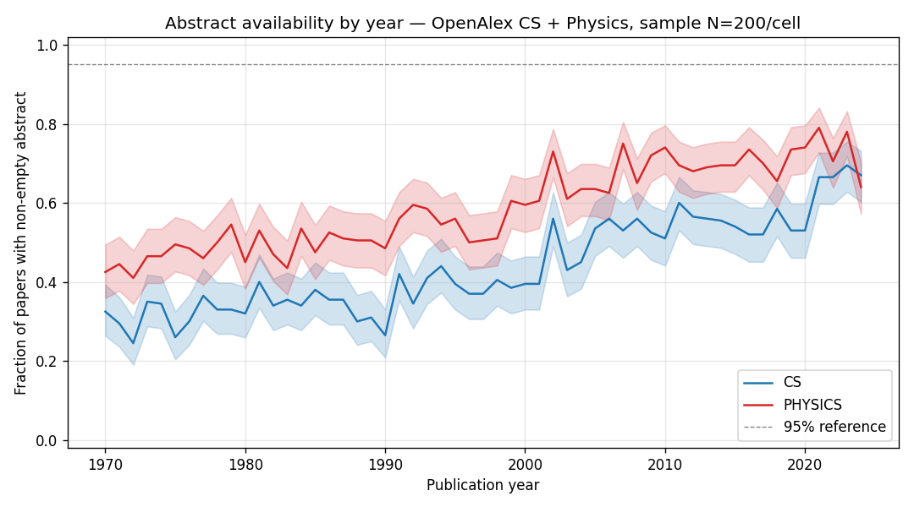

# Check 1 — Abstract availability by year

**Run date:** 2026-04-27
**Snapshot recorded:** 2026-04-27T20:20:00+00:00 (request-time; OpenAlex REST does not expose snapshot pinning — see desiderata §1)
**Sample design:** 200 papers per (year × field) cell, OpenAlex `?sample` with seed=42
**Years:** 1970–2024
**Fields:** CS (`C41008148`), Physics (`C121332964`)
**Total papers sampled:** 22000
**Total API calls (concepts + works):** 112

## Headline numbers

- **CS:** first year with coverage ≥95% = None; last year with coverage <50% = 2004
  - Mean pre-1990 coverage: 33.0%
  - Mean post-1990 coverage: 49.9%
- **Physics:** first year with coverage ≥95% = None; last year with coverage <50% = 1990
  - Mean pre-1990 coverage: 48.2%
  - Mean post-1990 coverage: 64.8%

## Implications for Phase 0.1

### Surprise: the plan's expectation is wrong

The Phase 0.1 plan §"Check 1" expected ">95% from ~1990 onward; drops sharply before ~1985."
Reality is **structurally different**:

- Coverage rises gradually from ~30% (1970) to ~70% (2024) in CS, with **no sharp pre-1985 drop**.
- **Neither field ever crosses 80%**, let alone 95%. Highest year-cell coverage is Physics 2021 at 79%.
- Physics is consistently ~15 pp higher than CS across all years.
- The shape is a **smooth gentle rise**, not a step function at any era boundary.

Spot-check confirms `has_abstract` logic is correct. The finding reflects OpenAlex's actual
abstract coverage: many publishers do not permit OpenAlex to redistribute abstracts, so coverage
is genuinely incomplete even for modern papers — not a measurement bug.

### §13 pre-1990 retention escalation rule

Plan's rule: "pre-1990 coverage <30% in either field → escalate to plan revision."

- **CS pre-1990 mean = 33.0%** — technically above the 30% threshold (no escalation required by the strict rule).
- **Individual pre-1990 CS year-cells below 30%:** 1971 (29.5%), 1972 (24.5%), 1975 (26.0%),
  1976 (30.0%), 1980 (32.0% — borderline), 1988 (30.0%).
- **Physics pre-1990 mean = 48.2%** — well above threshold.

Strict reading: no §13-specific escalation. But the **larger finding** (post-1990 coverage at ~50%
rather than ~95%) is a much bigger surprise and warrants its own re-plan discussion before Check 2.

### Bigger implication: post-1990 abstract bottleneck is tight throughout

The plan treated abstract coverage as a *pre-1990 only* concern. Reality is that abstract
coverage is the binding constraint throughout the entire 1970–2024 time series. This affects:

- **§1 embedding pipeline:** ~30–50% of papers have no abstract → no SPECTER2 embedding by
  default. Selection bias on the embedding-having subset is now a first-order concern, not a
  pre-1990 edge case.
- **§12 full-text policy:** the arXiv full-text fallback (currently positioned as a robustness
  check) likely needs to graduate to a primary alternative path, not a sensitivity analysis.
- **Check 2 (concept classifier drift):** the OpenAlex concept tagger uses abstract text. If
  abstracts are absent for ~50% of papers, classifier drift findings are conditional on the
  abstract-having subset.
- **§13 mitigation ladder:** the ladder targeted *pre-1990 drift mitigation*. The new finding
  suggests the more pressing constraint is the abstract-having selection bias *across all eras*.

### Recommended next steps before Check 2

1. **Flag this finding in `phase-0.1-plan.md` Check 1 status note** — the plan's expectation
   was wrong; the reality is qualitatively different.
2. **Re-evaluate §12 full-text policy** — should arXiv full-text become a primary path rather
   than a robustness check?
3. **Pause before Check 2** — Check 2 (concept classifier drift) operates on a heavily-
   subsetted population given Check 1's findings; the design may need adjustment.
4. **Acknowledge in Limitations:** ws2's analytical population is "OpenAlex-abstract-having
   CS+Physics papers 1970–2024," not "all OpenAlex CS+Physics papers" — the former is ~50%
   of the latter, with structured selection biases.

### Drift-mitigation ladder (§2)

Ladder unchanged at this stage; Check 5c (drift-pilot) remains the load-bearing diagnostic
for Flavor A commitment. But the abstract-coverage selection bias is a **separate**, newly-
surfaced concern that the ladder doesn't address.

## Plot

## Detailed table

See `abstract-coverage.csv` for the full year × field × {n_sampled, n_with_abstract,
coverage, ci_low, ci_high} table.
