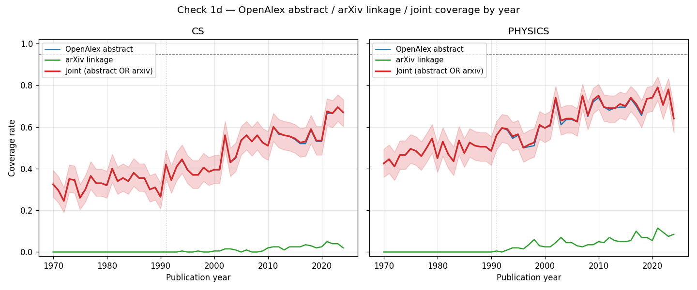

# Check 1d — arXiv linkage + joint coverage + access-method verification

**Run date:** 2026-04-27
**Snapshot recorded:** 2026-04-27T20:51:37+00:00
**Sample design:** same as Check 1 (200 papers per year × field cell, seed=42),
with `ids` + `locations` added to OpenAlex select projection.
**Total papers (joint analysis):** 22000
**Total API calls:** 210 (110 cell samples + 100 verification spot-checks)

## Joint coverage by era

| Field | Era | OpenAlex abstract | arXiv linkage | Joint (abstract OR arxiv) |
|-------|-----|------------------:|--------------:|--------------------------:|
| CS | 1970–1990 | 32.7% | 0.0% | 32.7% |
| CS | 1991–2024 | 50.6% | 1.4% | 50.7% |
| Physics | 1970–1990 | 48.2% | 0.0% | 48.2% |
| Physics | 1991–2024 | 65.3% | 4.8% | 65.8% |

## Access-method verification (100-paper spot-check)

Sampled 100 papers flagged `has_abstract=False` from Check 1's raw parquet
(via `?filter` + `?sample` code path). Re-fetched each via direct ID lookup
(`/works/W{id}` code path). Question: does the direct lookup return an
abstract that the filter-sample path missed?

- **Confirmed no abstract via direct lookup:** 100 / 100
- **Unexpected abstract via direct lookup:** 0 / 100
- **Lookup failed:** 0 / 100

If `n_unexpected` is small (≤2-3, plausibly 1-2% noise from concurrent
OpenAlex updates), the original Check 1 finding is robust to anonymous-
access / `?sample`-interaction concerns. If `n_unexpected` is meaningfully
large (≥10%), the original sample needs re-running through a different
path.

## Plot

## Interpretation

### Finding 1 — Access-method verification is clean (100/100)

All 100 papers flagged `has_abstract=False` via the `?filter`+`?sample` code path
also returned `has_abstract=False` via the direct ID-lookup code path. This
**rules out the user's anonymous-access concern**: the original Check 1 finding
is not an artifact of the API-key-vs-anonymous tier or of a `?sample`-specific
interaction. The ~50% abstract bottleneck is real OpenAlex data state.

### Finding 2 — arXiv linkage in OpenAlex is essentially absent (≤5%)

This is a surprise that **rules out path (A) as originally conceived** (promote
arXiv as a primary alternative path via OpenAlex's `locations` field). Across
post-1991 papers — well within the era where arXiv has substantial CS/Physics
coverage — OpenAlex flags only 1.4% (CS) / 4.8% (Physics) as having an arXiv
linkage.

Possible explanations:

- **OpenAlex's source-linkage logic is conservative:** OpenAlex tags arXiv as a
  location only when arXiv is a *primary* source for the work, not when the
  work simply has an arXiv preprint alongside a published version.
- **arXiv DOIs are recent (post-2022):** the `10.48550/arxiv.` DOI prefix only
  applies to the small subset of arxiv-as-publisher records, not historical
  preprints.
- **Upstream linkage gaps:** the cross-reference between published versions
  and arXiv preprints lives in different graphs (S2AG / Crossref / OpenAlex)
  with imperfect propagation.

Concretely: a 2017 CS paper with an arXiv preprint typically does NOT have
`S4306400194` in its OpenAlex locations. The arXiv-supplementation hypothesis
from Check 1c (preprints have 81-87% coverage → arXiv coverage is high) is
**operationally inaccessible via OpenAlex's location data alone**.

### What this rules out vs. what it points toward

**Rules out:**

- **Path (A) as conceived:** "use OpenAlex `locations` to identify arXiv
  papers, fall back to arXiv abstracts" does not work. The linkage just
  isn't there at scale.
- **Anonymous-access confounder:** Finding 1 confirms the original 50%
  number is the real OpenAlex coverage, not an access-tier artifact.

**Points toward (refined options):**

- **Path (A') — direct arxiv API integration via DOI/title matching.** For each
  OpenAlex paper without an abstract, query the arXiv API to check if a
  matching preprint exists (by DOI, title, or author+year). If found, pull
  the abstract from arXiv. arXiv's API is anonymous, but rate-limited at
  ~1 req/3s, so this is a **slow, multi-day batch job** for ~5-10M papers.
  Operationally feasible but expensive in time.
- **Path (C) — S2AG (Semantic Scholar) as primary abstract source.** ws2's
  `data/README.md` already lists S2AG as the primary source for SPECTER2
  embeddings. If S2AG has better abstract coverage than OpenAlex (which is
  likely — S2AG has its own coverage and arxiv linkage logic), it could
  serve as the primary abstract path with OpenAlex as the bibliographic
  spine. **This may be the cleanest answer.** Worth a small Check 1e:
  measure S2AG abstract coverage on the same 22K-paper sample.
- **Path (B) — acknowledge in Limitations and proceed.** ws2's analytical
  population becomes "OpenAlex-abstract-having CS+Physics papers
  1970-2024," roughly 50% of the field, with the limitations and
  selection-bias concerns made explicit.

### Recommended follow-up

A small **Check 1e** against S2AG: measure abstract coverage on the same 22K
paper IDs via Semantic Scholar's API. This decides between paths (A'), (C),
and (B). If S2AG has 80%+ coverage, path (C) becomes the clean answer. If
S2AG also tops out near 50%, paths (A') or (B) are the remaining options.

S2AG API is anonymous-friendly with a 100 req/sec limit (much higher than
arXiv); ~5 minutes wall-clock for 22K paper checks.
