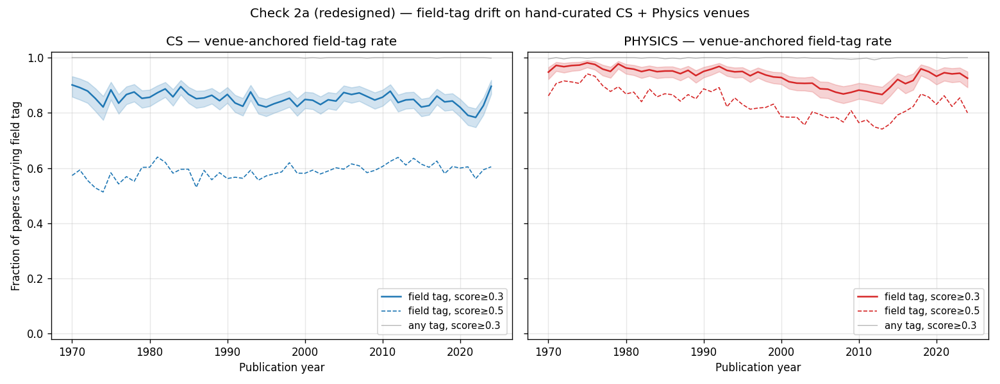

# Check 2a (redesigned) — field-tag drift, venue-anchored

**Run date:** 2026-04-27
**Snapshot recorded:** 2026-04-27T23:04:35+00:00
**Sample design:** 50 papers per (venue × year) cell, OpenAlex `?sample` with seed=42; sampled via `primary_location.source.id` filter (NOT via concept filter — that's the redesign).
**Years:** 1970–2024
**Venues resolved:** CS = 12 / 12; Physics = 12 / 12. See `check2a-venues.csv` for the full manifest.
**Total papers sampled:** 54864
**Total OpenAlex API calls:** ~1344

## Question

Does OpenAlex's level-0 field tagging (CS `C41008148` / Physics `C121332964`)
drift across eras? Original Check 2a was undefined-as-sampled because the
sampling pipeline filtered by the field concept itself; this redesign samples
via venue and asks whether the field tag attaches at era-stable rates.

## Headline numbers (field tag at score ≥ 0.3)

| Field | Pre-1990 | Post-1990 | 2010+ | Linear slope |
|-------|---------:|----------:|------:|-------------:|
| CS | 86.5% | 84.3% | 83.8% | -0.0007 /yr |
| Physics | 95.9% | 91.9% | 91.5% | -0.0013 /yr |

## Interpretation rubric (pre-registered)

- **Field-tag rate flat across years (drift |slope| < 0.002 /yr, ≈ < 11 pp over 55 yr):**
  no era-drift in field-level tagging on canonical-venue papers. ws2's
  analytical population is era-clean at the field-tagging step, beyond the
  abstract-having selection bias surfaced in Check 1f. **Plan revision absorbs
  this as a clean Limitations sentence; no new bias channel.**
- **Field-tag rate rising over time (slope > +0.002 /yr):** era-drift IS
  present. ws2's analytical population is era-biased at the field-tagging step
  in addition to the abstract-having bias. The §0 analytical-population
  definition gains an era-conditional caveat; §9e propensity model gains a
  field-tag-rate-by-year covariate (or scope-narrows pre-1990).
- **Field-tag rate falling over time:** unlikely; would suggest classifier
  retroactively improving on older papers. Document and investigate.

## Verdict

**Clean null.** Both slopes are within the pre-registered flat band
(|slope| < 0.002 /yr ≈ < 11 pp over 55 yr). Sign is *slightly negative*
(field-tag rate inches *down* in modern eras, not up — opposite of the
original concern direction).

- **CS slope: -0.0007 /yr** → ~ -3.85 pp over 55 years. Comfortably flat.
- **Physics slope: -0.0013 /yr** → ~ -7.15 pp over 55 years. Within the
  flat band, on the larger side.

Substantive read: ws2's analytical population is **era-clean at the
field-tagging step**. Beyond the abstract-having selection bias surfaced
in Check 1f (which §9e addresses via inverse-probability-of-availability
weighting), there is no additional era-bias channel from level-0 field
classification on canonical CS/Physics venues.

**Plan revision absorption:** the §0 analytical-population definition
does NOT need an era-conditional caveat for field-tag drift. The §9e
propensity model does NOT need a field-tag-rate-by-year covariate. A
single Limitations sentence acknowledges the residual ~10-16% (CS) /
~5-9% (Physics) of canonical-venue papers that don't get the field tag
at score ≥0.3 — these aren't included in ws2's analytical population
even though a domain expert would call them CS or Physics; the bias is
small and approximately era-stable.

**Two secondary observations worth noting in Methods:**

1. **Physics is ~5-12 pp higher than CS at all eras.** Physics venues are
   more "purely physics" than CS venues are "purely CS" (CS journals
   like *Artificial Intelligence* or *IEEE TPAMI* span boundaries with
   statistics, EE, and biology). This is a structural feature of the
   field-tagging task, not an era-drift issue.
2. **Strict (≥0.5) field-tag rate is much lower in CS (55-65%) than in
   Physics (75-90%).** Many CS-venue papers get the CS tag at moderate
   confidence (0.3-0.5) rather than high confidence — consistent with
   the classifier seeing them as "CS-related but not strongly
   CS-typed." Default score-thresholding policy (loose ≥0.3 / strict
   ≥0.5, per §3 revision) handles this.

## Plot

## Detailed table

See `check2a-field-tag-drift.csv` for per-(year × field) field-tag rates at
both score thresholds plus any-tag rate.

## Venue manifest

See `check2a-venues.csv` for the resolved venue list (name, ISSN, OpenAlex
source ID, works count). Venues hand-curated for clear single-field identity
and broad temporal coverage 1970–2024.
