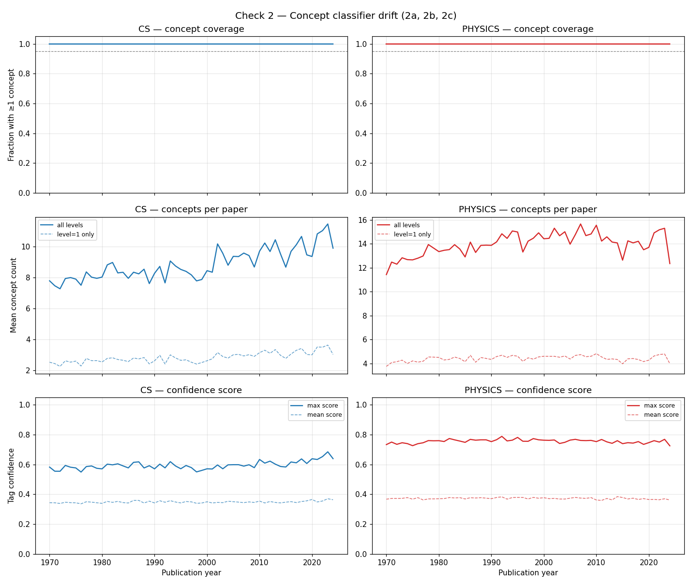

# Check 2 — Concept classifier drift (2a, 2b, 2c)

**Run date:** 2026-04-27
**Snapshot recorded:** 2026-04-27T22:02:08+00:00
**Sample design:** same as Check 1 (200 papers per year × field cell, seed=42),
with `concepts` added to OpenAlex select.
**Total papers:** 22000

## 2a — Concept coverage by year (fraction with ≥1 concept tag)

| Field | Pre-1990 | Post-1990 | Delta |
|-------|---------:|----------:|------:|
| CS | 100.0% | 100.0% | 0.0% |
| Physics | 100.0% | 100.0% | 0.0% |

**Red flag if:** monotonically increasing from low base (systematic under-tagging of older papers).

## 2b — Concepts per paper by year

| Field | Pre-1990 (mean) | Post-1990 (mean) | Ratio |
|-------|----------------:|-----------------:|------:|
| CS | 8.05 | 9.29 | 1.15 |
| Physics | 13.18 | 14.42 | 1.09 |

**Red flag if:** systematic temporal trend in concepts-per-paper (especially declining toward older years).

## 2c — Confidence score distribution by year

| Field | Pre-1990 max-score | Post-1990 max-score | Pre-1990 mean-score | Post-1990 mean-score |
|-------|--------------------:|--------------------:|--------------------:|---------------------:|
| CS | 0.58 | 0.60 | 0.35 | 0.35 |
| Physics | 0.75 | 0.76 | 0.37 | 0.37 |

**Red flag if:** systematically lower on older papers.

## Plot

## Interpretation

Three sub-check results with sharply different signals:

### 2a — Coverage is undefined as sampled

Our sample is filtered by `concepts.id:C41008148` (CS) or `C121332964` (Physics),
guaranteeing every paper has at least the field concept. So 100% concept coverage
is a sampling-design tautology, not a real measurement. **2a as originally
specified would require a different sampling strategy** (papers by year × venue
without a concept filter). For Phase 0.1 we leave this gap acknowledged and rely
on 2d + 2e as the substantive classifier-quality diagnostics. The plan-revision
pass should either redesign 2a or replace it.

### 2b — Concepts-per-paper has a modest temporal drift

CS: 8.05 → 9.29 (pre-1990 vs. post-1990, +15%). Physics: 13.18 → 14.42 (+10%).
Modest, not dramatic. Consistent with OpenAlex producing somewhat richer tagging
on modern (longer-abstract, more-text) papers. **Not a red flag in itself**, but
biases concept-count-weighted measures slightly toward richer modern signatures.

### 2c — Confidence scores are era-stable

CS max-score: 0.58 → 0.60. Physics max-score: 0.75 → 0.76. Mean-scores 0.35 / 0.37
in both eras. **No drift signal** — when the classifier tags a paper, its
confidence is era-stable.

This is the one piece of good news from Check 2: *within* tagged papers, tag
confidence is reliable across eras. The deeper question is whether the *set of
tagged papers* and the *correctness of those tags* is era-stable — which is what
2d and 2e address.
