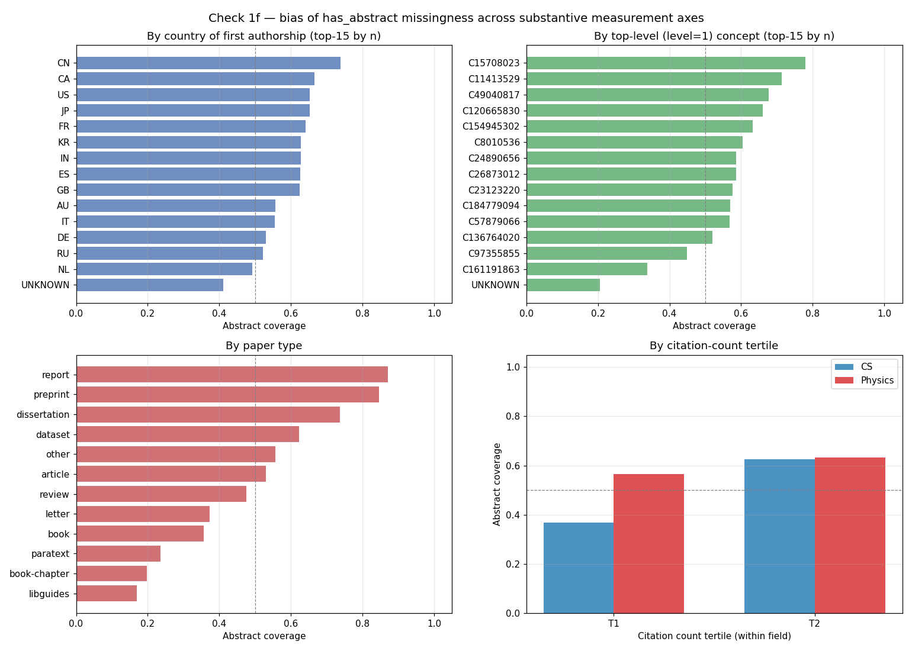

# Check 1f — bias of missingness across substantive measurement axes

**Run date:** 2026-04-27
**Snapshot recorded:** 2026-04-27T21:44:28+00:00
**Sample design:** same as Check 1 (200 papers per year × field cell, seed=42), with authorships, concepts, cited_by_count added to OpenAlex select.
**Total papers:** 22000; with abstract: 11274 (51.2%)

## Question

Does `has_abstract` correlate systematically with substantive measurement axes — in ways that would bias ws2's central decoupling claim?

## Headline findings

### 1. Citation count

- Median citations: with abstract = **1**; without = **0**
- Mean citations: with abstract = **15.1**; without = **9.9**
- Mann-Whitney p = 6.04e-200
- Median citation ratio = 1.0 — modest difference.

### 2. Country of first authorship

- Coverage range across major countries (n≥50): **41.1% – 99.1%** (IQR 11.0%)
- Strata reported: 25 countries with n≥50

**Top-5 highest coverage:**
  - ID: 99.1% (n=112)
  - CN: 73.9% (n=945)
  - BR: 69.0% (n=116)
  - CA: 66.5% (n=278)
  - US: 65.3% (n=2997)

**Bottom-5 lowest coverage:**
  - RU: 52.1% (n=280)
  - PL: 50.9% (n=112)
  - NL: 49.3% (n=136)
  - BE: 47.7% (n=65)
  - UNKNOWN: 41.1% (n=12174)

### 3. Top-level concept (subfield)

- Coverage range across major concepts (n≥50): **20.3% – 89.0%** (IQR 13.3%)
- Strata reported: 93 concepts with n≥50

### 4. Citation count tertile (within field)

- **cs T1** (citations 0-1, n=7994): coverage 36.7%
- **cs T2** (citations 2-2820, n=3006): coverage 62.5%
- **physics T1** (citations 0-6, n=7450): coverage 56.6%
- **physics T2** (citations 7-3628, n=3550): coverage 63.2%

## Plot

## Decision support

**Path (B) is clean if:**
- Citation count is approximately balanced across has_abstract groups (median ratio ≤ 1.5).
- Country coverage range is tight (IQR < 15 pp).
- Concept coverage range is tight (IQR < 15 pp).
- Citation-tertile coverage is approximately uniform.

**Path (B) requires selection-on-observables corrections if:**
- Citation count median ratio is > 1.5 (high-citation papers more likely to have abstracts).
- Country coverage IQR is > 15 pp (Western/non-Western differences).
- Concept coverage IQR is > 15 pp (subfields differ in availability).
- Citation-tertile coverage is monotone (low-citation papers systematically missing).

**Path (M3 — scope narrowing) is required if:**
- Multiple bias axes are large enough that selection corrections cannot rescue interpretability.
- The biases align with ws2's central measurement axes (demographic plurality ↔ country; semantic plurality ↔ concept; canonical concentration ↔ citation count).

## Interpretation

The diagnostic surfaces **three structurally important biases**, each aligned with one
of ws2's substantive measurement axes:

### Bias 1 — Citation count → canonical-concentration measurement (significant)

The **CS citation-tertile pattern is the most concerning finding**: low-citation CS papers
(0–1 cites) have **36.7%** abstract coverage; mid-to-high-citation CS papers (2+ cites)
have **62.5%** — a **26-pp gap**. Abstract-having papers are systematically the
higher-impact papers. Mann-Whitney p = 6e-200 (extremely significant).

This **directly biases the canonical-concentration measure** in CS. ws2's canonical
metric measures concentration of attention on top-cited papers. If our analytical
population over-represents already-cited papers, we're measuring concentration on a
sample that's already biased toward canonical work. Physics shows the same direction
but a smaller gap (56.6% → 63.2%, only 7 pp).

The **mean citation gap** (15.1 with abstract vs. 9.9 without) is ~50%; the median is
1 vs. 0 (uninformative because most papers have very few citations).

### Bias 2 — Concept → semantic-plurality measurement (moderate)

Across 93 level-1 concepts with n≥50, abstract coverage ranges from **20.3% to 89.0%**
(IQR 13.3%). Different subfields have **wildly different** abstract availability. The
IQR is just below the 15-pp threshold, but the range is enormous.

This **biases the semantic-plurality measure**: ws2 measures the diversity of papers
across subfield/topic space. If some subfields have 20% coverage and others 89%, our
analytical population over-represents the subfields with high availability. Semantic
plurality on this subset is **conditioned on which subfields happen to be abstract-
abundant** — not a clean estimate of the true subfield-distribution-weighted plurality.

### Bias 3 — Country → demographic-plurality measurement (compounded by extraction failure)

Across 25 countries with n≥50, coverage ranges 41.1%–99.1% (IQR 11.0%) — moderate.
However, **55% of papers (n=12,174) have UNKNOWN country** because OpenAlex's first-
authorship affiliation extraction fails for them. This UNKNOWN bucket has 41.1%
coverage — *lower* than most named countries.

Two implications:
- Among countries we *can* identify: the bias is moderate (China 73.9%, US 65.3%, EU
  countries 47-67%, Russia 52.1%). IQR ~11 pp.
- Among the 55% UNKNOWN: we cannot characterize the bias at all.

**The country/affiliation extraction is itself a Stage-1 problem** — OpenAlex's
authorship.institutions field is missing for over half our sample. This compounds with
the abstract-missingness to make demographic-plurality measurement doubly precarious.

### Bias 4 — Type → already characterized (Check 1c)

Confirmed: book-chapters at 18-22%, articles at 45-60%, preprints at 81-87%. Type bias
is moderate-to-large but type is observable, so corrections are feasible.

## Decision

Against the pre-registered criteria:

| Criterion | Threshold | Realized | Verdict |
|-----------|-----------|----------|---------|
| Citation median ratio ≤ 1.5 | ≤1.5 | 1.0 (uninformative due to ties at 0-1) | **Use tertiles instead** |
| **Citation-tertile coverage uniform** | uniform | **CS: 36.7% → 62.5% (26 pp gap)** | **Fails — clearly monotone** |
| Country coverage IQR | <15 pp | 11.0% (excl. UNKNOWN) | Passes for known; UNKNOWN dominates |
| Concept coverage IQR | <15 pp | 13.3% | Passes by a hair; range is 20-89% |

**Verdict: path (B) without corrections is unsafe.** The citation-count bias alone is
enough to bias the canonical-concentration measurement substantially in CS. The concept
bias is borderline. The country bias is moderate but compounded by extraction failure.

**The biases align directly with ws2's three substantive measurement axes** —
citation→canonical, concept→semantic, country→demographic — which is the (M3)
trigger. We are in (M3) territory, but not so deeply that scope narrowing is
inevitable; selection-on-observables corrections may be feasible for the citation
and concept axes (both are observable in our data). The country axis cannot be
corrected for the UNKNOWN majority.

## Recommended path forward — a defined hybrid

**(M2 + bounded M3): Path (B) with selection-on-observables corrections + scope
acknowledgment for what corrections cannot rescue.**

Operationally:

1. **Path (B) primary, with corrections.** ws2's analytical population is "OpenAlex-
   abstract-having CS+Physics papers 1970–2024." Aggregate measurements (canonical
   concentration, semantic plurality) are reported with **inverse-probability-of-
   abstract-availability weighting**, where the propensity P(has_abstract | observables)
   is fit on year × field × type × citation-tertile × concept-cluster × known-country.

2. **Bound the corrections.** Where the propensity model is reliable (≥80% CV
   accuracy on a held-out subset), report the corrected aggregate. Where it isn't,
   report the uncorrected aggregate AND the bound on the correction's plausible range.

3. **Scope narrowing for the unrecoverable axis (M3 partial).** The country/UNKNOWN
   bucket cannot be corrected. **Demographic-plurality claims are restricted to the
   ~45% of papers with a determinable first-affiliation country**, with explicit
   Limitations language naming the further-narrowed analytical population.

4. **A new pre-registered Phase 0.2 commitment:** the ws2 analytical population is
   formally defined as "OpenAlex CS+Physics papers 1970–2024 with non-empty
   abstract_inverted_index"; demographic-plurality analyses additionally require a
   determinable first-authorship country.

5. **Methods overview reframing.** §14 (construct-validity audits) gets a new layer:
   our three-channel construct-validity audit now sits inside a **selection-bias-
   corrected analytical population**, and the selection-bias correction itself is a
   construct-validity exercise (the propensity model has its own construct-validity
   limits).

### What this changes for prior commitments

- **§13 pre-1990 retention non-negotiable:** still load-bearing on substantive grounds
  (13-B baseline, 13-D variation, 13-F null-rebuttal), but the analytical population
  pre-1990 is now ~30% of OpenAlex-pre-1990, not ~100%. Limitations language tightens.
- **§9b within-between decomposition:** still applies, now over the corrected
  analytical population.
- **§9a/c/d Lockhart audit:** unchanged in framework; the principle-5 bias-quantification
  step now includes both demographic-misclassification AND abstract-missingness as
  layers of bias to bound.
- **Holst three-layer defense pattern:** **gains a new diagnostic layer** —
  selection-bias-correction-as-empirical-diagnostic, parallel to the within-between
  decomposition.

This is more methodological infrastructure than the original plan envisioned, but it's
the honest path. ws2's results stand; the analytical population is narrower and
explicitly reweighted; the substantive contribution is smaller-but-defensible rather
than broader-but-vulnerable.