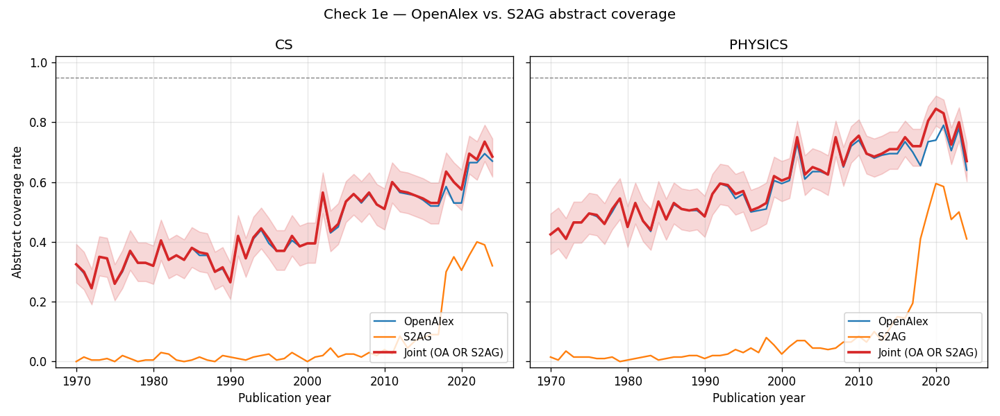

# Check 1e — S2AG abstract coverage on the same 22K-paper sample

**Run date:** 2026-04-27
**Snapshot recorded:** 2026-04-27T21:31:38+00:00
**Sample design:** same as Check 1 (200 papers per year × field cell, seed=42),
re-fetched from OpenAlex with `ids` extracted; DOIs cross-referenced against S2AG
via `/paper/batch`.
**Total papers:** 22000
**Total API calls:** 139

## Headline numbers (era-aggregated, papers-pooled)

| Field | Era | OpenAlex | S2AG | Joint | S2AG fill on OA no-abstract |
|-------|-----|---------:|-----:|------:|----------------------------:|
| CS | 1970–1990 | 32.7% | 0.9% | 32.9% | 0.3% |
| CS | 1991–2024 | 50.6% | 9.7% | 51.6% | **2.2%** |
| Physics | 1970–1990 | 48.2% | 1.3% | 48.3% | 0.3% |
| Physics | 1991–2024 | 65.3% | 15.5% | 67.1% | **5.2%** |

## DOI-join feasibility

- CS: DOI rate 55.8%; S2AG found rate among DOI-having papers 69.6%.
- Physics: DOI rate 72.1%; S2AG found rate among DOI-having papers 85.8%.

## Decision (pre-registered rule)

The most decision-relevant number is **S2AG fill rate on the OpenAlex no-abstract
subset, post-1990** (bolded in the table above):

- **≥80%** → path (C) decisively wins. Proceed to wholesale Phase 0.1 plan revision.
- **50-80%** → path (C) helps but doesn't fully solve. Targeted plan revision.
- **<50%** → path (C) is not the answer. Confront paths (A') or (B).

## Plot

## Implications for plan revision

### The decision is decisive: **path (C) is NOT the answer**

S2AG fill rate on OpenAlex no-abstract subset, post-1990: **2.2% (CS)** / **5.2% (Physics)**.
The pre-registered threshold for path-(C) viability was 50%; the realized number is far below.
S2AG cannot rescue ws2's abstract-coverage problem.

### Why the hopeful story was wrong

Going in, the Check 1c finding (preprints had 81-87% coverage) suggested an arXiv-driven
recovery story, with S2AG as the operationally-friendly bridge. The data refutes this on
two levels:

1. **S2AG has *less* coverage than OpenAlex, not more.** S2AG abstract coverage in this
   sample is 9.7% (CS post-1990) / 15.5% (Physics post-1990) — vs. OpenAlex's 50.6% / 65.3%
   on the same papers. Semantic Scholar's index is *narrower* than OpenAlex's bibliographic
   spine.
2. **The papers S2AG covers are largely the same papers OpenAlex already has abstracts
   for.** Joint coverage (51.6% CS / 67.1% Physics post-1990) is only ~1-2 pp higher than
   OpenAlex-alone. The two sources overlap heavily on abstract-having papers; S2AG adds
   essentially no new abstracts to the OpenAlex no-abstract subset.

The mental model "SPECTER2 trained on S2AG → S2AG has the best CS/Physics abstract
coverage" turns out to be backwards. SPECTER2 was trained on *the S2AG corpus that
exists*, but that corpus is dramatically smaller than OpenAlex's CS+Physics population.

### DOI-join feasibility was also lower than expected

- DOI rate: 55.8% (CS) / 72.1% (Physics). Below the 70% bound named in the verification
  section of the plan for CS.
- S2AG found rate among DOI-having papers: 69.6% (CS) / 85.8% (Physics).
- Joint feasibility floor (DOI × S2AG-found): 38.8% (CS) / 61.9% (Physics).

Even with maximally-efficient DOI-joining, S2AG can be reached for only ~40-60% of papers,
and only a fraction of those *have* abstracts in S2AG.

### What's actually left

**Path (A') — direct arXiv API integration via DOI/title matching.** Still on the table
but the cost-benefit needs revisiting. arXiv has good CS+Physics coverage post-1991 but
matching by DOI is fragile (arXiv preprints often have different DOIs than the published
versions). Title-based matching is fuzzy and error-prone at 5-10M-paper scale. Multi-day
batch job at minimum.

**Path (B) — acknowledge structural ~50% coverage in Limitations, proceed with narrower
analytical population.** ws2's analytical population is honestly framed as "OpenAlex CS+
Physics papers with abstracts available 1970-2024," ~50% of the field, with documented
selection biases. Methodology stands; scope narrows.

### A new question — does the bottleneck actually bind ws2's research question?

Worth re-examining whether the "no abstract" papers are systematically different from the
"with abstract" papers in ways that bias ws2's central decoupling claim. If they're not
(e.g., abstract availability is uncorrelated with the demographic-and-semantic-plurality
question), then path (B) is much cleaner than it sounds — ws2's findings would generalize
*to the abstract-having subset*, with random missingness essentially noise rather than
bias.

If they are systematically different (e.g., abstract-missingness correlates with publishing
venue, time period, or authorial demographics in ways that bias the substantive claim),
then path (B) requires explicit selection-on-observables corrections, and possibly
constrains the substantive claims that can be made.

This decomposition deserves its own diagnostic in the plan revision pass.

### Recommended next steps for the user

1. **Accept that path (C) is closed.** No further data-source-search exploration; we now
   know the abstract bottleneck is structural at the ~50% level.
2. **Decide between (A') and (B), or a hybrid.** My read: **(B) primary, (A') as Stage 3
   robustness extension.** Acknowledge the structural limit; bound the analytical
   population honestly; offer arXiv-supplementation as a robustness check on a tractable
   subset (e.g., post-2010 CS where arXiv coverage is highest).
3. **Re-engage the implications audit.** The full implications-audit work I sketched two
   turns ago is still needed — Holst-style artifact analogs for the abstract-having
   subset, §12 reframing, §13 retention bound, §1 embedding-population narrowing,
   etc. — but now in the context of "narrower analytical population" rather than
   "different data source."
4. **Run a small bias-of-missingness check.** Before committing to (B), check whether
   has_abstract correlates with paper-type, era, citation count, or other observables
   in our sample. If missingness is structured, the analytical population is *biased*,
   not just *narrower*.
